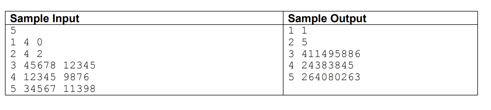

## Implementation in Touro's MCO364 of the following problem:

Compute the integer contained in the specified row and column of The Rascal Triangle.

The Rascal Triangle definition is similar to that of the Pascal Triangle.
The rows are numbered from the top starting with 0. Each row n contains n+1
numbers indexed from 0 to n. Using R(n, m) to indicate the index m item in the index n row:

R(n,m) = 0 for n < 0 OR m < 0 OR m > n

The first and last numbers in each row (which are the same in the top row) are 1:

R(n,0) = R(n,n) = 1

The interior values are determined by(UpLeftEntry*UpRightEntry + 1)/UpEntry

(see the parallelogram in the array below):

R(n+1,m+1) = (R(n,m) * R(n,m+1) + 1)/R(n-1, m)

                1
              1   1
            1   2   1
              /   \
         1   3     3   1
              \   /
       1   4    5    4    1
       
Write a program which computes R(n,m) the mth element of the nth row of the Rascal Triangle.

#### Input

The first line of input contains a single integer P, (1 <u><</u> P <u><</u> 1000), which is the number
of data sets that follow. Each data set is a single line of input consisting of 3 space
separated decimal integers. The first integer is data set number, N. The second integer is row
number n, and the third integer is the index m within the row of the entry for which you are to find R(n,m)
the Rascal Triangle entry (0 <u><</u> n <u><</u> 50000).

#### Output

For each data set there is one line of output. It contains the data set number, N, followed by a single
space which is then followed by the Rascal Triangle entry R(n,m) accurate to the nearest integer value.

